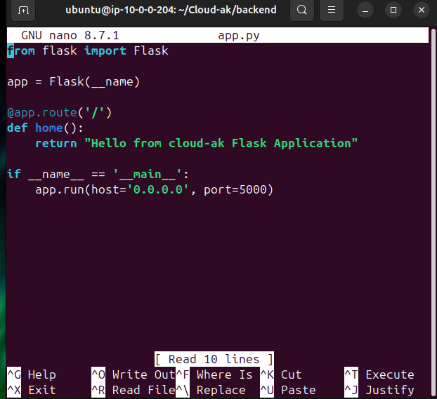
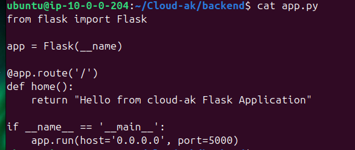
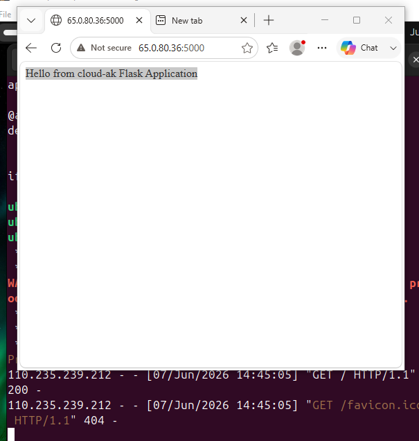
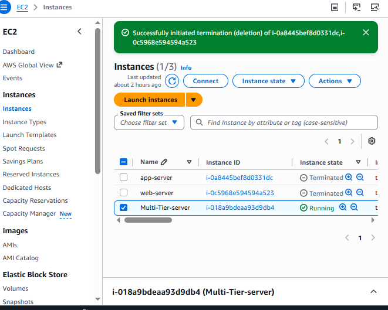

# CLOUD--ak - Flask + Nginx on AWS EC2

## 🚀 Project Overview
This project demonstrates deployment of a Python Flask web application on AWS EC2 with Nginx configured as a reverse proxy.

---

## 🏗️ Architecture

User Browser  
↓  
Nginx (Port 80)  
↓  
Flask Application (Port 5000)

---

## ⚙️ Technologies Used

- AWS EC2 (Ubuntu)
- Linux Server
- Python Flask
- Nginx
- Git & GitHub

---

## 🔥 Features

- Flask backend deployed on EC2
- Nginx reverse proxy configuration
- Public access via EC2 IP
- Production-like server setup
- GitHub-based version control

---

## 📸 Screenshots

### Flask Application Running

### Browser Output

### Nginx Status

### EC2 Instance

---

## 🌐 How It Works

1. User opens EC2 public IP in browser  
2. Request goes to Nginx (port 80)  
3. Nginx forwards request to Flask (port 5000)  
4. Flask processes request and returns response  
5. Nginx sends response back to browser  

---

## 🧠 Key Learnings

- Linux server management
- AWS EC2 deployment
- Flask web application setup
- Nginx reverse proxy configuration
- Git & GitHub workflow

---
Testing Webhook - 07 July 2026
## 👨‍💻 Author
Ashok Kumar Maurya

Cloud/DevOps Learning Project - CLOUD-104
